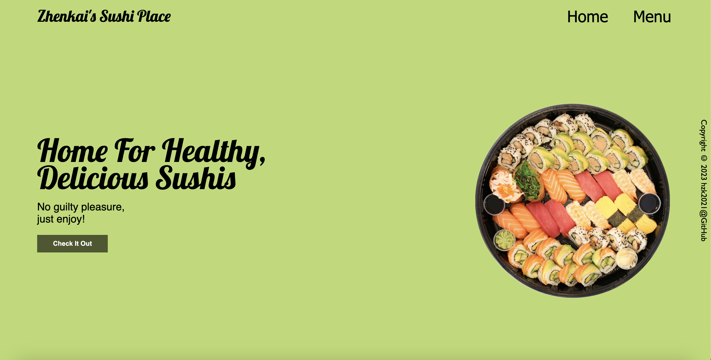
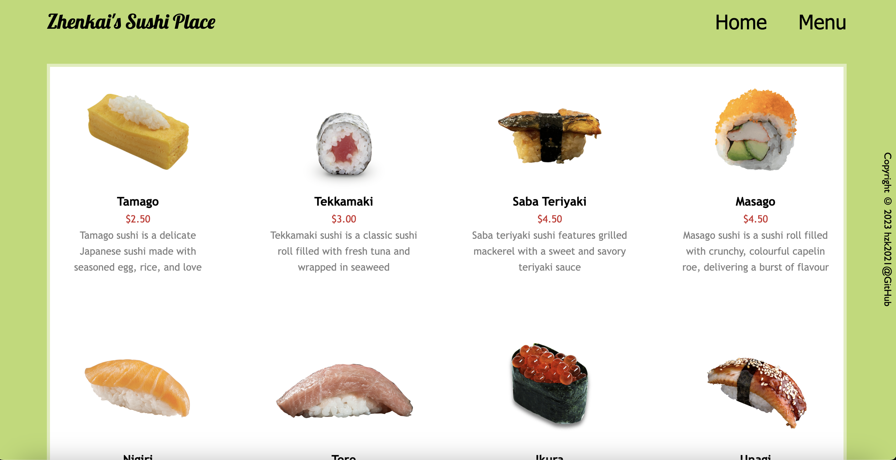
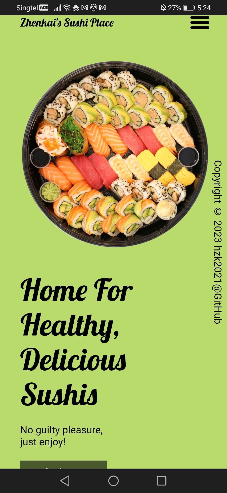
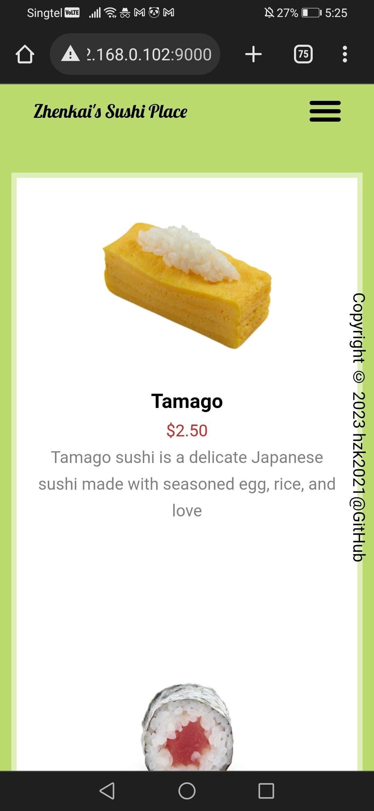

# Zhenkai's Sushi Place

This is a responsive restaurant site created with JavaScript and Webpack for dynamic content.

## [Live Demo](https://hzk2021.github.io/SushiRestaurant/)

Home (Desktop)

Menu (Desktop)

Menu (Mobile)

Menu (Mobile)

### Languages Used

  &emsp;   &emsp;   &emsp;  